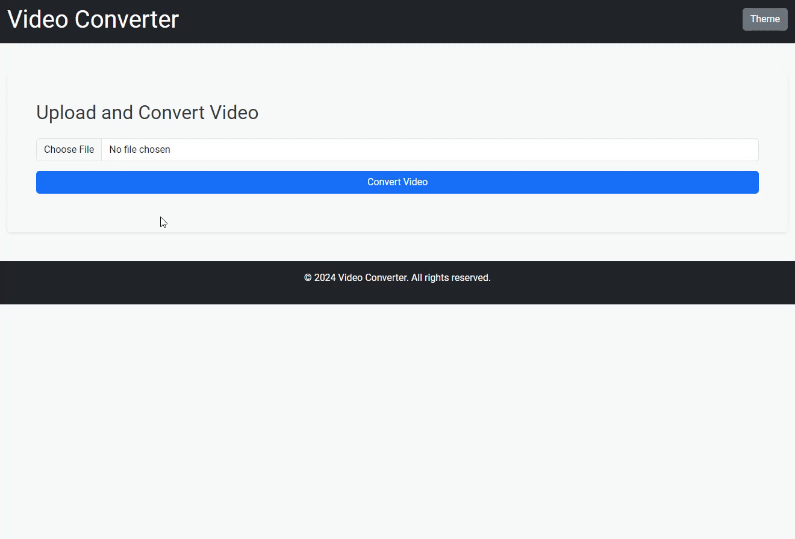

# Video Conversion to Web Format Project



## Description

This project is a web application that allows the conversion of video files from a specific format (incompatible with web standards) to a format compatible with modern browsers. The application enables users to upload a video, perform the conversion, and watch the converted video directly in the browser. The application uses **Python** and **Flask** for the backend, **Amazon S3** for file storage, and **MoviePy** for video conversion.

## Features

- **Video Upload**: Web interface for video file uploads.
- **Video Conversion**: Converts videos to a browser-compatible format (e.g., from AVI to MP4).
- **S3 Storage**: Videos are stored in Amazon S3 before and after conversion.
- **Video Playback**: Users can watch the converted video directly in the browser.

## Technologies Used

- **Python 3**
- **Flask**: Web framework used to create the application.
- **MoviePy**: Library for video conversion.
- **Amazon S3**: Cloud file storage.
- **Amazon EC2**: Hosting platform for application deployment.
- **Python-dotenv**: To securely manage environment variables.

## Prerequisites

Before you begin, make sure you have the following tools installed:

- **Python 3.8+**
- **pip** (Python package manager)
- **Git**

## Installation

1. Clone the repository:

   ```bash
   git clone https://github.com/your-username/your-repository.git
   cd your-repository
   ```

2. Create and activate a virtual environment:

   ```bash
   python3 -m venv venv
   source venv/bin/activate  # For Linux/MacOS
   venv\Scripts\activate   # For Windows
   ```

3. Install the dependencies:

   ```bash
   pip install -r requirements.txt
   ```

4. Configure environment variables by creating a `.env` file in the root of the project:

   ```plaintext
   AWS_ACCESS_KEY_ID=your-access-key-id
   AWS_SECRET_ACCESS_KEY=your-secret-access-key
   S3_BUCKET_NAME=your-bucket-name
   S3_REGION=your-region
   ```

## Usage

1. Run the application locally:

   ```bash
   python app.py
   ```

2. Access the application in the browser:

   ```
   http://127.0.0.1:5000
   ```
